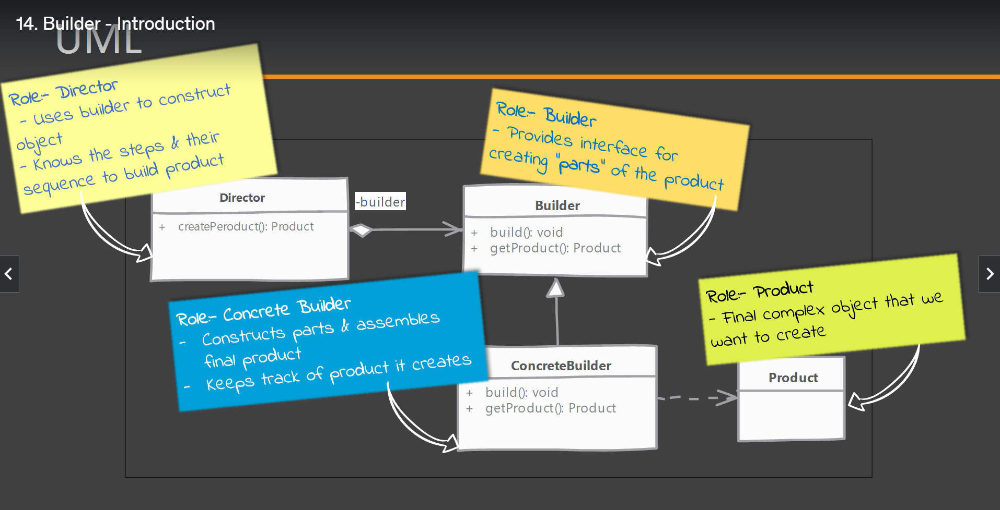

#### It is creational design patterns

### Problems it solves

1. class constructor requires lot of information.
2. Objects that need other objects or parts to construct them.

### what is builder?

- We have a complex process to construct an object involving multiple steps, then builder design pattern can help us
- In builder we remove the logic related to object construction from "Client code" and abstract it in seperate class.

### UML Diagram

### Examples

- String builder in java.lang.StringBuilder class but not a 100% builder
- ByteBuffer, CharBuffer in java.nio package
- builder pattern in java 8. Java.util.Calender.Builder

### Compare & Contrast with Prototype

### pitfalls

- A litte bit complex for new comers maily beacuse of `method chaining`, where builder methods return builder object itself.
- Possibility of partially initialized object; User code can set only a few or none of properties using withXXX methods and call build(). If required properties are missing, build method should provide suitable defaults or throw exceptions